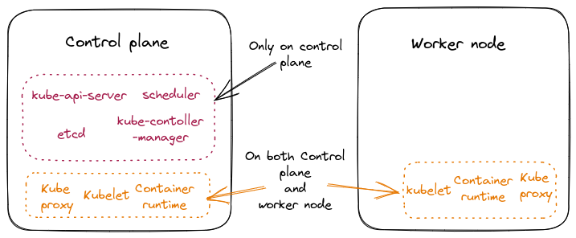

### Recap

Please refer this [repo](https://github.com/madhank93/learn-k8s-ckad) to go through the core concepts of k8s.

### Q&A

1. 

   
 What need to be installed in Control plane and Worker node ?

   

   

   **Control plane** - API server, Scheduler, ETCD and Controller manager, Kubelet, Kube proxy and Container runtime

   **Worker node** - Kubelet, Kube proxy and Container runtime

   

   

1. 

   
 What are the prerequisites that need to be installed and how to be installed ?

   

   - For prerequisites refer [here](https://kubernetes.io/docs/setup/production-environment/tools/kubeadm/install-kubeadm/#before-you-begin)
   - Installing container runtime (CRI) refer [here](https://kubernetes.io/docs/setup/production-environment/tools/kubeadm/install-kubeadm/#installing-runtime)
   - Installing kubeadm, kubelet and kubectl refer [here](https://kubernetes.io/docs/setup/production-environment/tools/kubeadm/install-kubeadm/#installing-kubeadm-kubelet-and-kubectl)

      - **kubelet** - It is a process runs on all the instances (master/worker node) and it takes of running pods and containers ...etc
      - **kubeadm** - It is a command line tool, initializes the k8s cluster
      - **kubectl** - It is a command line tool to interact with the cluster.

   

   

1. 

   
 What are Static pods ?

   

   Static Pods or Master pods (API server, Scheduler, ETCD and Controller manager) are managed directly by the kubelet daemon on a specific node, without the API server observing them or control plane. `Kubelet` continuously watches for `/etc/kubernetes/manifests` folder on a node and schedules the pods according to the manifests files.

   For more info refer [here](https://kubernetes.io/docs/tasks/configure-pod-container/static-pod/)

   

   

### Reference

- [kodekloudhub/certified-kubernetes-administrator-course](https://github.com/kodekloudhub/certified-kubernetes-administrator-course)